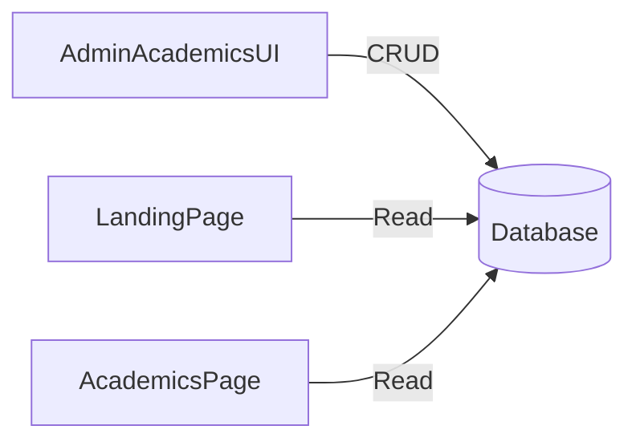

# Akademik Setup (Programs + Faculty Highlights)

## Scope

- Gunakan `landing_programs` sebagai sumber data program, tambah kolom level (undergraduate/graduate/certificate) untuk filter.
- Tambahkan entitas baru `academics_faculty_highlights` untuk highlight faculty.
- Tampilkan program filter & faculty highlight di halaman Academics, dan faculty highlight juga di landing section.
- Tambahkan menu admin “Academics Setup” dengan CRUD sederhana untuk Programs & Faculty Highlights.
- Seeder untuk program level & faculty highlight, plus permission `manage academics`.

## Rencana Perubahan

1. **Database & Model**

   - Tambah migration untuk kolom `program_level` di `landing_programs`.
   - Buat migration + model `AcademicsFacultyHighlight` di `app/Models`.
   - Tambah/ubah seeder (baru `AcademicsPageSeeder`) untuk isi data awal.

2. **Admin CRUD (custom Blade)**

   - Tambah controller & views untuk:
     - Programs (reuse `LandingProgramController` + form update level).
     - Faculty Highlights (controller baru + views baru di `resources/views/admin/academics`).
   - Tambah route group `dashboard/academics` di `routes/web.php` dengan permission `manage academics`.
   - Tambah menu di `resources/views/layouts/navigation.blade.php` dan kartu di `resources/views/admin/landing/index.blade.php` atau buat `resources/views/admin/academics/index.blade.php` sebagai menu utama akademik.

3. **Frontend Display**

   - Update `CollegeAcademicsController` (baru) untuk kirim program terkelompok by level + faculty highlights.
   - Update route `/academics` dari `Route::view` ke controller.
   - Refactor `resources/views/college/academics.blade.php` agar:
     - Filter tabs pakai data DB (UG/Grad/Certificate).
     - Cards program dari DB (isotope class berdasarkan level).
     - Faculty highlight list dari DB.
   - Update `LandingPageController` + `resources/views/college/index.blade.php` untuk menampilkan faculty highlights di landing (gunakan section toggle baru `faculty_highlights` di `landing_sections`).

4. **Permissions & Seeder**

   - Tambah permission `manage academics` di `database/seeders/UserSeeder.php`.
   - Tambah `AcademicsPageSeeder` ke `DatabaseSeeder`.

## File Utama yang Akan Disentuh

- [`database/migrations/..._create_landing_programs_table.php`](database/migrations/2026_01_19_060030_create_landing_programs_table.php) (add column via new migration)
- [`app/Models/LandingProgram.php`](app/Models/LandingProgram.php)
- [`app/Models/AcademicsFacultyHighlight.php`](app/Models/AcademicsFacultyHighlight.php)
- [`app/Http/Controllers/Admin/LandingProgramController.php`](app/Http/Controllers/Admin/LandingProgramController.php)
- [`resources/views/admin/landing/programs/partials/form.blade.php`](resources/views/admin/landing/programs/partials/form.blade.php)
- [`app/Http/Controllers/Admin/AcademicsFacultyHighlightController.php`](app/Http/Controllers/Admin/AcademicsFacultyHighlightController.php)
- [`resources/views/admin/academics/...`](resources/views/admin/academics)
- [`routes/web.php`](routes/web.php)
- [`app/Http/Controllers/CollegeAcademicsController.php`](app/Http/Controllers/CollegeAcademicsController.php)
- [`resources/views/college/academics.blade.php`](resources/views/college/academics.blade.php)
- [`resources/views/college/index.blade.php`](resources/views/college/index.blade.php)
- [`database/seeders/AcademicsPageSeeder.php`](database/seeders/AcademicsPageSeeder.php)
- [`database/seeders/UserSeeder.php`](database/seeders/UserSeeder.php)
- [`database/seeders/DatabaseSeeder.php`](database/seeders/DatabaseSeeder.php)
- [`resources/views/layouts/navigation.blade.php`](resources/views/layouts/navigation.blade.php)

## Diagram Alur

